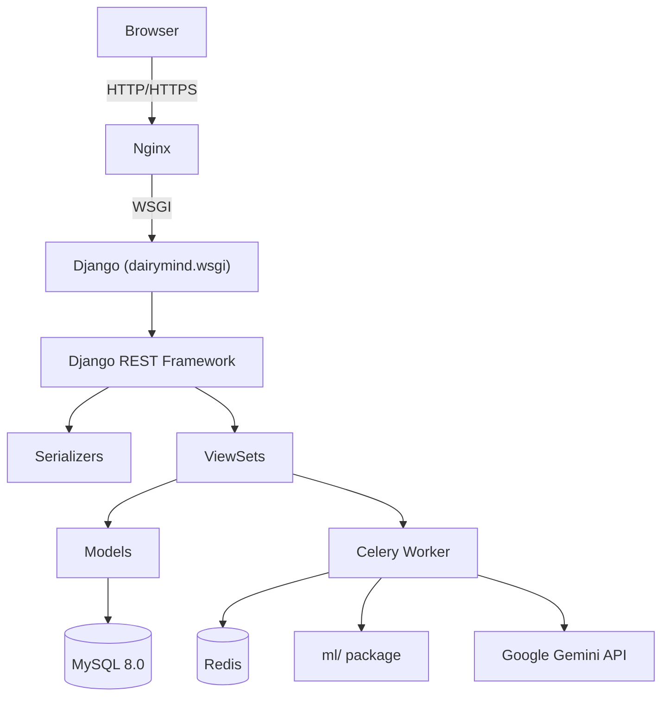
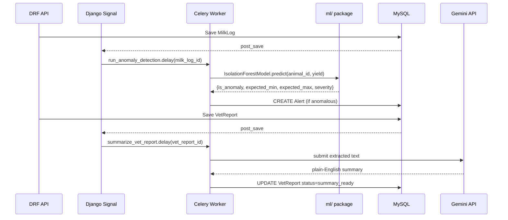

# Design Document: DairyMind Smart Dairy Farm Management System

## Overview

DairyMind is a full-stack Django 4.2 web application for managing dairy farm operations. It
combines a REST API backend with a Bootstrap 5 + Chart.js frontend, Celery/Redis async task
processing, Scikit-learn + Facebook Prophet ML models, and Google Gemini AI for document
summarization. The system centralizes cattle registry, milk tracking, health monitoring,
production forecasting, veterinary report analysis, feed cost optimization, and breeding
lifecycle management.

The architecture follows a split-settings Django project pattern with clearly separated apps,
an `apps/` package for domain modules, and a standalone `ml/` package for ML model wrappers.
All sensitive configuration is injected via environment variables using python-decouple.

---

## 1. Project Structure

Exact directory layout satisfying Requirement 10.1:

```
dairymind/
├── manage.py
├── requirements.txt
├── .env.example
├── docker-compose.yml
├── dairymind/                     # Django project config package
│   ├── __init__.py                # imports Celery app for auto-discovery
│   ├── settings/
│   │   ├── __init__.py
│   │   ├── base.py                # shared settings
│   │   ├── development.py         # DEBUG=True, local DB overrides
│   │   └── production.py          # HTTPS, HSTS, production DB
│   ├── urls.py                    # root URL conf
│   ├── celery.py                  # Celery application instance
│   └── wsgi.py
├── apps/
│   ├── __init__.py
│   ├── accounts/
│   │   ├── models.py
│   │   ├── serializers.py
│   │   ├── views.py
│   │   ├── urls.py
│   │   ├── permissions.py
│   │   └── admin.py
│   ├── cattle/
│   │   ├── models.py
│   │   ├── serializers.py
│   │   ├── views.py
│   │   ├── urls.py
│   │   └── signals.py
│   ├── milk/
│   │   ├── models.py
│   │   ├── serializers.py
│   │   ├── views.py
│   │   ├── urls.py
│   │   └── signals.py
│   ├── health/
│   │   ├── models.py
│   │   ├── serializers.py
│   │   ├── views.py
│   │   ├── urls.py
│   │   └── tasks.py
│   ├── forecast/
│   │   ├── models.py
│   │   ├── serializers.py
│   │   ├── views.py
│   │   ├── urls.py
│   │   └── tasks.py
│   ├── vet_reports/
│   │   ├── models.py
│   │   ├── serializers.py
│   │   ├── views.py
│   │   ├── urls.py
│   │   └── tasks.py
│   ├── costs/
│   │   ├── models.py
│   │   ├── serializers.py
│   │   ├── views.py
│   │   └── urls.py
│   └── breeding/
│       ├── models.py
│       ├── serializers.py
│       ├── views.py
│       ├── urls.py
│       └── tasks.py
├── ml/
│   ├── __init__.py
│   ├── anomaly_detection.py       # IsolationForestModel
│   ├── forecasting.py             # ProphetForecaster
│   └── breeding_model.py          # BreedingSuccessModel
├── templates/
│   ├── base.html
│   ├── dashboard.html
│   ├── accounts/
│   │   └── login.html
│   ├── cattle/
│   │   ├── list.html
│   │   └── detail.html
│   ├── milk/
│   │   └── logs.html
│   ├── health/
│   │   └── alerts.html
│   ├── forecast/
│   │   └── forecast.html
│   ├── vet_reports/
│   │   └── upload.html
│   ├── costs/
│   │   └── optimizer.html
│   └── breeding/
│       └── calendar.html
└── static/
    ├── css/
    │   └── dairymind.css
    ├── js/
    │   ├── dashboard.js
    │   ├── charts.js
    │   └── api.js
    └── vendor/
        ├── bootstrap/
        └── chart.js/
```

---

## 2. Django Settings Architecture

### 2.1 Settings Module Layout

`DJANGO_SETTINGS_MODULE` is set per environment. `manage.py` defaults to
`dairymind.settings.development`; the Docker entrypoint sets it to
`dairymind.settings.production`.

### 2.2 `dairymind/settings/base.py`

```python
from decouple import config, Csv
from pathlib import Path

BASE_DIR = Path(__file__).resolve().parent.parent.parent

SECRET_KEY = config('SECRET_KEY')

INSTALLED_APPS = [
    'django.contrib.admin',
    'django.contrib.auth',
    'django.contrib.contenttypes',
    'django.contrib.sessions',
    'django.contrib.messages',
    'django.contrib.staticfiles',
    # Third-party
    'rest_framework',
    'rest_framework.authtoken',
    'corsheaders',
    'django_filters',
    'drf_spectacular',
    # Project apps
    'apps.accounts',
    'apps.cattle',
    'apps.milk',
    'apps.health',
    'apps.forecast',
    'apps.vet_reports',
    'apps.costs',
    'apps.breeding',
]

MIDDLEWARE = [
    'django.middleware.security.SecurityMiddleware',
    'whitenoise.middleware.WhiteNoiseMiddleware',
    'corsheaders.middleware.CorsMiddleware',
    'django.contrib.sessions.middleware.SessionMiddleware',
    'django.middleware.common.CommonMiddleware',
    'django.middleware.csrf.CsrfViewMiddleware',
    'django.contrib.auth.middleware.AuthenticationMiddleware',
    'django.contrib.messages.middleware.MessageMiddleware',
    'django.middleware.clickjacking.XFrameOptionsMiddleware',
]

ROOT_URLCONF = 'dairymind.urls'

AUTH_USER_MODEL = 'accounts.CustomUser'

DATABASES = {
    'default': {
        'ENGINE': 'django.db.backends.mysql',
        'NAME': config('DB_NAME', default='dairymind_db'),
        'USER': config('DB_USER'),
        'PASSWORD': config('DB_PASSWORD'),
        'HOST': config('DB_HOST', default='localhost'),
        'PORT': config('DB_PORT', default='3306'),
        'OPTIONS': {'charset': 'utf8mb4'},
    }
}

REST_FRAMEWORK = {
    'DEFAULT_AUTHENTICATION_CLASSES': [
        'rest_framework.authentication.TokenAuthentication',
    ],
    'DEFAULT_PERMISSION_CLASSES': [
        'rest_framework.permissions.IsAuthenticated',
    ],
    'DEFAULT_FILTER_BACKENDS': [
        'django_filters.rest_framework.DjangoFilterBackend',
    ],
    'DEFAULT_PAGINATION_CLASS': 'rest_framework.pagination.PageNumberPagination',
    'PAGE_SIZE': 20,
    'MAX_PAGE_SIZE': 100,
    'DEFAULT_SCHEMA_CLASS': 'drf_spectacular.openapi.AutoSchema',
}

# Celery
CELERY_BROKER_URL = config('CELERY_BROKER_URL', default='redis://localhost:6379/0')
CELERY_RESULT_BACKEND = config('CELERY_RESULT_BACKEND', default='redis://localhost:6379/0')
CELERY_ACCEPT_CONTENT = ['json']
CELERY_TASK_SERIALIZER = 'json'
CELERY_TIMEZONE = 'UTC'

CELERY_BEAT_SCHEDULE = {
    'generate-all-forecasts-nightly': {
        'task': 'forecast.tasks.generate_all_forecasts',
        'schedule': crontab(hour=2, minute=0),
    },
    'check-upcoming-heats-daily': {
        'task': 'breeding.tasks.check_upcoming_heats',
        'schedule': crontab(hour=6, minute=0),
    },
}

# Static files — Whitenoise
STATIC_URL = '/static/'
STATIC_ROOT = BASE_DIR / 'staticfiles'
STATICFILES_STORAGE = 'whitenoise.storage.CompressedManifestStaticFilesStorage'

# Media files
MEDIA_URL = '/media/'
MEDIA_ROOT = BASE_DIR / 'media'

# CORS
CORS_ALLOWED_ORIGINS = config('CORS_ALLOWED_ORIGINS', default='http://localhost:3000', cast=Csv())

# Auth token expiry via custom middleware — 8 hours (28800 seconds)
TOKEN_EXPIRY_SECONDS = 8 * 60 * 60

# Login lockout settings (django-axes or custom)
AXES_FAILURE_LIMIT = 5
AXES_COOLOFF_TIME = 0.5  # 30 minutes as fraction of hours

GEMINI_API_KEY = config('GEMINI_API_KEY')
```

### 2.3 `dairymind/settings/development.py`

```python
from .base import *

DEBUG = True
ALLOWED_HOSTS = ['localhost', '127.0.0.1']

# Override DB for local dev if needed via .env
EMAIL_BACKEND = 'django.core.mail.backends.console.EmailBackend'
```

### 2.4 `dairymind/settings/production.py`

```python
from .base import *

DEBUG = False
ALLOWED_HOSTS = config('ALLOWED_HOSTS', cast=Csv())

SECURE_HSTS_SECONDS = 31536000
SECURE_HSTS_INCLUDE_SUBDOMAINS = True
SECURE_SSL_REDIRECT = True
SESSION_COOKIE_SECURE = True
CSRF_COOKIE_SECURE = True
```

### 2.5 `dairymind/celery.py`

```python
import os
from celery import Celery
from celery.schedules import crontab

os.environ.setdefault('DJANGO_SETTINGS_MODULE', 'dairymind.settings.development')

app = Celery('dairymind')
app.config_from_object('django.conf:settings', namespace='CELERY')
app.autodiscover_tasks()
```

### 2.6 `dairymind/__init__.py`

```python
from .celery import app as celery_app

__all__ = ('celery_app',)
```

---

## 3. Data Models

### 3.1 `apps/accounts/models.py`

```python
from django.contrib.auth.models import AbstractUser
from django.db import models

class CustomUser(AbstractUser):
    class Role(models.TextChoices):
        ADMIN        = 'Admin',        'Admin'
        FARM_MANAGER = 'Farm_Manager', 'Farm Manager'
        VET          = 'Vet',          'Vet'

    role = models.CharField(
        max_length=20,
        choices=Role.choices,
        default=Role.FARM_MANAGER,
    )
    failed_login_attempts = models.IntegerField(default=0)
    lockout_until = models.DateTimeField(null=True, blank=True)

    class Meta:
        db_table = 'users'
```

### 3.2 `apps/cattle/models.py`

```python
from django.db import models
from apps.accounts.models import CustomUser

class Animal(models.Model):
    class Gender(models.TextChoices):
        MALE   = 'Male',   'Male'
        FEMALE = 'Female', 'Female'

    class Status(models.TextChoices):
        ACTIVE   = 'Active',   'Active'
        DRY      = 'Dry',      'Dry'
        SOLD     = 'Sold',     'Sold'
        DECEASED = 'Deceased', 'Deceased'

    tag_number   = models.CharField(max_length=20, unique=True)
    name         = models.CharField(max_length=100)
    breed        = models.CharField(max_length=100)
    date_of_birth = models.DateField()
    gender       = models.CharField(max_length=10, choices=Gender.choices)
    status       = models.CharField(max_length=10, choices=Status.choices, default=Status.ACTIVE)
    sire_tag     = models.CharField(max_length=20, blank=True, null=True)
    dam_tag      = models.CharField(max_length=20, blank=True, null=True)
    purchase_date = models.DateField(null=True, blank=True)
    notes        = models.CharField(max_length=1000, blank=True)
    is_deleted   = models.BooleanField(default=False)
    created_at   = models.DateTimeField(auto_now_add=True)
    updated_at   = models.DateTimeField(auto_now=True)

    class Meta:
        db_table = 'animals'

class AnimalHistory(models.Model):
    class ActionType(models.TextChoices):
        CREATED = 'created', 'Created'
        UPDATED = 'updated', 'Updated'
        DELETED = 'deleted', 'Deleted'

    animal      = models.ForeignKey(Animal, on_delete=models.CASCADE, related_name='history')
    changed_by  = models.ForeignKey(CustomUser, on_delete=models.SET_NULL, null=True)
    changed_at  = models.DateTimeField(auto_now_add=True)
    action_type = models.CharField(max_length=10, choices=ActionType.choices)
    previous_values = models.JSONField()
    changed_fields  = models.JSONField()

    class Meta:
        db_table = 'animal_history'
        ordering = ['-changed_at']
```

### 3.3 `apps/milk/models.py`

```python
from django.db import models
from apps.cattle.models import Animal

class MilkLog(models.Model):
    animal          = models.ForeignKey(Animal, on_delete=models.CASCADE, related_name='milk_logs')
    log_date        = models.DateField()
    morning_yield   = models.DecimalField(max_digits=6, decimal_places=2)
    evening_yield   = models.DecimalField(max_digits=6, decimal_places=2)
    total_yield     = models.DecimalField(max_digits=6, decimal_places=2, editable=False)
    notes           = models.CharField(max_length=500, blank=True)
    created_at      = models.DateTimeField(auto_now_add=True)

    class Meta:
        db_table  = 'milk_logs'
        unique_together = ('animal', 'log_date')

    def save(self, *args, **kwargs):
        self.total_yield = self.morning_yield + self.evening_yield
        super().save(*args, **kwargs)
```

### 3.4 `apps/health/models.py`

```python
from django.db import models
from apps.cattle.models import Animal
from apps.accounts.models import CustomUser

class Alert(models.Model):
    class Severity(models.TextChoices):
        LOW    = 'Low',    'Low'
        MEDIUM = 'Medium', 'Medium'
        HIGH   = 'High',   'High'

    animal           = models.ForeignKey(Animal, on_delete=models.CASCADE, related_name='alerts')
    alert_date       = models.DateField()
    observed_yield   = models.DecimalField(max_digits=6, decimal_places=2)
    expected_min     = models.DecimalField(max_digits=6, decimal_places=2)
    expected_max     = models.DecimalField(max_digits=6, decimal_places=2)
    severity         = models.CharField(max_length=10, choices=Severity.choices)
    acknowledged     = models.BooleanField(default=False)
    acknowledged_by  = models.ForeignKey(CustomUser, null=True, blank=True,
                                          on_delete=models.SET_NULL,
                                          related_name='acknowledged_alerts')
    acknowledged_at  = models.DateTimeField(null=True, blank=True)
    created_at       = models.DateTimeField(auto_now_add=True)

    class Meta:
        db_table = 'alerts'
        ordering = ['-created_at']
```

### 3.5 `apps/forecast/models.py`

```python
from django.db import models
from apps.cattle.models import Animal

class Forecast(models.Model):
    animal          = models.ForeignKey(Animal, null=True, blank=True,
                                         on_delete=models.CASCADE, related_name='forecasts')
    generated_at    = models.DateTimeField(auto_now_add=True)
    forecast_date   = models.DateField()
    predicted_yield = models.DecimalField(max_digits=8, decimal_places=2)
    lower_bound     = models.DecimalField(max_digits=8, decimal_places=2)
    upper_bound     = models.DecimalField(max_digits=8, decimal_places=2)

    class Meta:
        db_table = 'forecasts'
        # animal=NULL means herd-level forecast
        indexes = [models.Index(fields=['animal', 'forecast_date'])]
```

### 3.6 `apps/vet_reports/models.py`

```python
from django.db import models
from apps.cattle.models import Animal
from apps.accounts.models import CustomUser

class VetReport(models.Model):
    class Status(models.TextChoices):
        PENDING       = 'pending_summarization', 'Pending Summarization'
        READY         = 'summary_ready',         'Summary Ready'
        FAILED        = 'summary_failed',         'Summary Failed'

    class FileType(models.TextChoices):
        PDF  = 'application/pdf',  'PDF'
        TEXT = 'text/plain',       'Plain Text'

    animal                = models.ForeignKey(Animal, on_delete=models.CASCADE,
                                               related_name='vet_reports')
    uploaded_by           = models.ForeignKey(CustomUser, on_delete=models.SET_NULL, null=True)
    uploaded_at           = models.DateTimeField(auto_now_add=True)
    file_path             = models.FileField(upload_to='vet_reports/')
    file_type             = models.CharField(max_length=30, choices=FileType.choices)
    plain_english_summary = models.TextField(null=True, blank=True)
    status                = models.CharField(max_length=30, choices=Status.choices,
                                              default=Status.PENDING)
    error_reason          = models.TextField(null=True, blank=True)

    class Meta:
        db_table = 'vet_reports'
```

### 3.7 `apps/costs/models.py`

```python
from django.db import models
from apps.cattle.models import Animal
from apps.accounts.models import CustomUser

class FeedCost(models.Model):
    animal         = models.ForeignKey(Animal, null=True, blank=True,
                                        on_delete=models.CASCADE, related_name='feed_costs')
    entry_date     = models.DateField()
    feed_type      = models.CharField(max_length=100)
    quantity_kg    = models.DecimalField(max_digits=8, decimal_places=2)
    cost_per_kg    = models.DecimalField(max_digits=8, decimal_places=2)
    total_feed_cost = models.DecimalField(max_digits=10, decimal_places=2, editable=False)
    created_at     = models.DateTimeField(auto_now_add=True)

    class Meta:
        db_table = 'feed_costs'

    def save(self, *args, **kwargs):
        self.total_feed_cost = self.quantity_kg * self.cost_per_kg
        super().save(*args, **kwargs)

class FarmConfig(models.Model):
    key        = models.CharField(max_length=100, unique=True)
    value      = models.CharField(max_length=255)
    updated_by = models.ForeignKey(CustomUser, on_delete=models.SET_NULL, null=True)
    updated_at = models.DateTimeField(auto_now=True)

    class Meta:
        db_table = 'farm_config'
```

### 3.8 `apps/breeding/models.py`

```python
from django.db import models
from django.utils import timezone
from datetime import timedelta
from apps.cattle.models import Animal

class HeatCycle(models.Model):
    animal       = models.ForeignKey(Animal, on_delete=models.CASCADE, related_name='heat_cycles')
    observed_date = models.DateField()
    notes        = models.CharField(max_length=500, blank=True)
    created_at   = models.DateTimeField(auto_now_add=True)

    class Meta:
        db_table = 'heat_cycles'
        ordering = ['-observed_date']

class AIEvent(models.Model):
    class Outcome(models.TextChoices):
        PENDING            = 'Pending',            'Pending'
        CONFIRMED_PREGNANT = 'Confirmed_Pregnant', 'Confirmed Pregnant'
        FAILED             = 'Failed',             'Failed'

    animal             = models.ForeignKey(Animal, on_delete=models.CASCADE, related_name='ai_events')
    insemination_date  = models.DateField()
    bull_code          = models.CharField(max_length=100)
    technician_name    = models.CharField(max_length=100)
    outcome            = models.CharField(max_length=25, choices=Outcome.choices,
                                           default=Outcome.PENDING)
    created_at         = models.DateTimeField(auto_now_add=True)
    updated_at         = models.DateTimeField(auto_now=True)

    class Meta:
        db_table = 'ai_events'

class Pregnancy(models.Model):
    animal                = models.ForeignKey(Animal, on_delete=models.CASCADE,
                                               related_name='pregnancies')
    conception_date       = models.DateField()
    expected_calving_date = models.DateField(blank=True)
    actual_calving_date   = models.DateField(null=True, blank=True)
    created_at            = models.DateTimeField(auto_now_add=True)
    updated_at            = models.DateTimeField(auto_now=True)

    class Meta:
        db_table = 'pregnancies'

    def save(self, *args, **kwargs):
        if not self.expected_calving_date:
            self.expected_calving_date = self.conception_date + timedelta(days=283)
        super().save(*args, **kwargs)

class BreedingPrediction(models.Model):
    animal                   = models.ForeignKey(Animal, on_delete=models.CASCADE,
                                                  related_name='breeding_predictions')
    predicted_heat_date      = models.DateField()
    insemination_window_end  = models.DateTimeField()
    success_probability      = models.DecimalField(max_digits=4, decimal_places=3)
    insufficient_history_flag = models.BooleanField(default=False)
    generated_at             = models.DateTimeField(auto_now_add=True)

    class Meta:
        db_table = 'breeding_predictions'
        ordering = ['-generated_at']
```

---

## 4. REST API Design

### 4.1 Architecture Overview



### 4.2 Root URL Configuration — `dairymind/urls.py`

```python
from django.urls import path, include
from drf_spectacular.views import SpectacularAPIView, SpectacularSwaggerUIView

urlpatterns = [
    path('api/auth/',      include('apps.accounts.urls')),
    path('api/cattle/',    include('apps.cattle.urls')),
    path('api/milk/',      include('apps.milk.urls')),
    path('api/alerts/',    include('apps.health.urls')),
    path('api/forecast/',  include('apps.forecast.urls')),
    path('api/vet-reports/', include('apps.vet_reports.urls')),
    path('api/costs/',     include('apps.costs.urls')),
    path('api/breeding/',  include('apps.breeding.urls')),
    path('api/dashboard/', include('apps.accounts.dashboard_urls')),
    path('api/export/',    include('apps.accounts.export_urls')),
    # OpenAPI docs
    path('api/schema/',    SpectacularAPIView.as_view(), name='schema'),
    path('api/docs/',      SpectacularSwaggerUIView.as_view(url_name='schema'), name='swagger-ui'),
    # Template views
    path('',               include('apps.accounts.template_urls')),
]
```

### 4.3 Authentication Endpoints — `apps/accounts/`

**Serializers:**
```python
class LoginSerializer(serializers.Serializer):
    username = serializers.CharField()
    password = serializers.CharField(write_only=True)

class UserSerializer(serializers.ModelSerializer):
    class Meta:
        model  = CustomUser
        fields = ['id', 'username', 'email', 'role', 'first_name', 'last_name']
```

**Views:**
```python
class LoginView(APIView):
    permission_classes = [AllowAny]
    # POST /api/auth/login/
    # Validates credentials, checks lockout, issues Token, resets failure count
    # Returns: {token, user: {id, username, role}}
    # Error 401 on bad creds (no field hint), 429 if locked out

class LogoutView(APIView):
    # POST /api/auth/logout/
    # Deletes the user's Token, returns 204
```

**URLs — `apps/accounts/urls.py`:**
```python
urlpatterns = [
    path('login/',  LoginView.as_view()),
    path('logout/', LogoutView.as_view()),
]
```

### 4.4 Cattle Registry — `apps/cattle/`

**Serializers:**
```python
class AnimalHistorySerializer(serializers.ModelSerializer):
    changed_by = serializers.StringRelatedField()
    class Meta:
        model  = AnimalHistory
        fields = ['id', 'action_type', 'changed_by', 'changed_at',
                  'previous_values', 'changed_fields']

class AnimalSerializer(serializers.ModelSerializer):
    class Meta:
        model  = Animal
        fields = ['id', 'tag_number', 'name', 'breed', 'date_of_birth',
                  'gender', 'status', 'sire_tag', 'dam_tag', 'purchase_date', 'notes']

    def validate_tag_number(self, value):
        # enforce uniqueness on create/update, raise ValidationError on duplicate
        ...

    def validate_date_of_birth(self, value):
        # must not be in the future
        ...
```

**ViewSets:**
```python
class AnimalViewSet(viewsets.ModelViewSet):
    queryset = Animal.objects.filter(is_deleted=False)
    serializer_class = AnimalSerializer
    filter_backends  = [DjangoFilterBackend, SearchFilter]
    search_fields    = ['tag_number', 'name', 'breed', 'status']
    pagination_class = StandardPagination  # page_size=20, max=100

    def perform_create(self, serializer):
        animal = serializer.save()
        AnimalHistory.objects.create(
            animal=animal, changed_by=self.request.user,
            action_type='created', previous_values={}, changed_fields={}
        )

    def perform_update(self, serializer):
        # capture previous values before save, write history entry
        ...

    def perform_destroy(self, instance):
        # soft-delete: set is_deleted=True, write history entry
        ...

    @action(detail=True, methods=['get'])
    def history(self, request, pk=None):
        # GET /api/cattle/{id}/history/
        ...
```

**URLs — `apps/cattle/urls.py`:**
```python
router = DefaultRouter()
router.register('', AnimalViewSet, basename='cattle')
urlpatterns = router.urls
# Produces: GET/POST /api/cattle/, GET/PUT/DELETE /api/cattle/{id}/, GET /api/cattle/{id}/history/
```

### 4.5 Milk Tracker — `apps/milk/`

**Serializers:**
```python
class MilkLogSerializer(serializers.ModelSerializer):
    animal_tag = serializers.SlugRelatedField(
        slug_field='tag_number', queryset=Animal.objects.all(), source='animal'
    )
    class Meta:
        model  = MilkLog
        fields = ['id', 'animal_tag', 'log_date', 'morning_yield',
                  'evening_yield', 'total_yield', 'notes', 'created_at']
        read_only_fields = ['total_yield', 'created_at']

    def validate(self, data):
        # check morning_yield >= 0, evening_yield >= 0
        # check uniqueness of (animal, log_date) combination
        ...

class BulkMilkLogSerializer(serializers.Serializer):
    entries = MilkLogSerializer(many=True)  # accepts up to 100
```

**Views:**
```python
class MilkLogViewSet(viewsets.ModelViewSet):
    queryset         = MilkLog.objects.select_related('animal')
    serializer_class = MilkLogSerializer
    filter_backends  = [DjangoFilterBackend]
    filterset_fields = ['animal', 'log_date']

class BulkMilkLogView(APIView):
    # POST /api/milk/logs/bulk/
    # Accepts list of up to 100 entries, validates each independently
    # Returns {created_count, errors: [{index, field, message}]}

class HerdSummaryView(APIView):
    # GET /api/milk/herd-summary/?start_date=&end_date=
    # Returns [{date, total_yield}] suitable for Chart.js

class AnimalYieldSeriesView(APIView):
    # GET /api/milk/animal/{animal_id}/series/?start_date=&end_date=
    # Returns [{date, total_yield}] for up to 365 days
```

### 4.6 Health Alerts — `apps/health/`

**Serializers:**
```python
class AlertSerializer(serializers.ModelSerializer):
    animal_tag     = serializers.SlugRelatedField(slug_field='tag_number',
                                                   read_only=True, source='animal')
    acknowledged_by = serializers.StringRelatedField()
    class Meta:
        model  = Alert
        fields = ['id', 'animal_tag', 'alert_date', 'observed_yield',
                  'expected_min', 'expected_max', 'severity',
                  'acknowledged', 'acknowledged_by', 'acknowledged_at', 'created_at']
```

**Views:**
```python
class AlertViewSet(viewsets.ReadOnlyModelViewSet):
    queryset         = Alert.objects.select_related('animal', 'acknowledged_by')
    serializer_class = AlertSerializer
    filter_backends  = [DjangoFilterBackend]
    filterset_fields = ['animal__tag_number', 'severity', 'acknowledged']
    # Supports date range filtering via custom filterset

    @action(detail=True, methods=['post'])
    def acknowledge(self, request, pk=None):
        # POST /api/alerts/{id}/acknowledge/
        # Idempotency guard: reject if already acknowledged (400)
        # Sets acknowledged=True, acknowledged_by, acknowledged_at
        ...
```

### 4.7 Forecast — `apps/forecast/`

**Serializers:**
```python
class ForecastSerializer(serializers.ModelSerializer):
    class Meta:
        model  = Forecast
        fields = ['id', 'forecast_date', 'predicted_yield',
                  'lower_bound', 'upper_bound', 'generated_at']

class ForecastResponseSerializer(serializers.Serializer):
    animal_id   = serializers.IntegerField(allow_null=True)  # null for herd
    forecasts   = ForecastSerializer(many=True)
    is_stale    = serializers.BooleanField()  # True if generated_at > 24h ago
    generated_at = serializers.DateTimeField()
```

**Views:**
```python
class HerdForecastView(APIView):
    # GET /api/forecast/herd/
    # Returns 30-day herd forecast with staleness warning if > 24h old

class AnimalForecastView(APIView):
    # GET /api/forecast/animal/{animal_id}/
    # Returns 30-day per-animal forecast; 422 if < 60 logs

class ForecastRefreshView(APIView):
    # POST /api/forecast/refresh/
    # Enqueues generate_single_forecast or generate_all_forecasts
    # Returns {task_id, status: 'pending'}
```

### 4.8 Vet Reports — `apps/vet_reports/`

**Serializers:**
```python
class VetReportSerializer(serializers.ModelSerializer):
    class Meta:
        model  = VetReport
        fields = ['id', 'animal', 'uploaded_by', 'uploaded_at', 'file_type',
                  'status', 'plain_english_summary', 'error_reason']
        read_only_fields = ['uploaded_by', 'uploaded_at', 'status',
                            'plain_english_summary', 'error_reason']

class VetReportUploadSerializer(serializers.Serializer):
    animal_id = serializers.PrimaryKeyRelatedField(queryset=Animal.objects.all())
    file      = serializers.FileField()

    def validate_file(self, value):
        allowed = ['application/pdf', 'text/plain']
        if value.content_type not in allowed:
            raise serializers.ValidationError('Unsupported file type.')  # → 415
        if value.size > 10 * 1024 * 1024:
            raise serializers.ValidationError('File too large.')          # → 413
        return value
```

**Views:**
```python
class VetReportListView(generics.ListAPIView):
    # GET /api/vet-reports/?animal_id=
    serializer_class  = VetReportSerializer
    filter_backends   = [DjangoFilterBackend]
    filterset_fields  = ['animal']

class VetReportUploadView(APIView):
    # POST /api/vet-reports/upload/
    # Saves file, creates VetReport record, enqueues summarize_vet_report task
    # Returns 201 within 3 seconds (task is async)
    parser_classes = [MultiPartParser]

class VetReportDetailView(generics.RetrieveAPIView):
    # GET /api/vet-reports/{id}/
    serializer_class = VetReportSerializer
    queryset         = VetReport.objects.all()
```

### 4.9 Cost Optimizer — `apps/costs/`

**Serializers:**
```python
class FeedCostSerializer(serializers.ModelSerializer):
    class Meta:
        model  = FeedCost
        fields = ['id', 'animal', 'entry_date', 'feed_type', 'quantity_kg',
                  'cost_per_kg', 'total_feed_cost', 'created_at']
        read_only_fields = ['total_feed_cost']

    def validate_quantity_kg(self, value):
        if value <= 0:
            raise serializers.ValidationError('Must be > 0')
        return value

    def validate_cost_per_kg(self, value):
        if value <= 0:
            raise serializers.ValidationError('Must be > 0')
        return value

class FarmConfigSerializer(serializers.ModelSerializer):
    class Meta:
        model  = FarmConfig
        fields = ['key', 'value', 'updated_at']

class ROIDailyBreakdownSerializer(serializers.Serializer):
    date              = serializers.DateField()
    daily_feed_cost   = serializers.DecimalField(max_digits=10, decimal_places=2)
    daily_milk_revenue = serializers.DecimalField(max_digits=10, decimal_places=2)
    daily_roi_ratio   = serializers.DecimalField(max_digits=8, decimal_places=4, allow_null=True)

class ROIResponseSerializer(serializers.Serializer):
    total_feed_cost  = serializers.DecimalField(max_digits=12, decimal_places=2)
    milk_revenue     = serializers.DecimalField(max_digits=12, decimal_places=2)
    roi_ratio        = serializers.DecimalField(max_digits=8, decimal_places=4, allow_null=True)
    daily_breakdown  = ROIDailyBreakdownSerializer(many=True)
    error            = serializers.CharField(allow_null=True)
```

**Views:**
```python
class FeedCostViewSet(viewsets.ModelViewSet):
    queryset         = FeedCost.objects.all()
    serializer_class = FeedCostSerializer

class ROIView(APIView):
    # GET /api/costs/roi/?animal_id=&start_date=&end_date=
    # Validates date range <= 365 days
    # Guards against zero total_feed_cost and missing milk_price_per_liter config
    ...

class LowPerformersView(APIView):
    # GET /api/costs/low-performers/?month=YYYY-MM
    # Returns bottom 10% by ROI; minimum 1 animal
    ...

class FarmConfigView(APIView):
    # GET  /api/costs/config/ — returns current config
    # PUT  /api/costs/config/ — validates value > 0, persists, logs updated_by
    ...
```

### 4.10 Breeding Manager — `apps/breeding/`

**Serializers:**
```python
class HeatCycleSerializer(serializers.ModelSerializer):
    class Meta:
        model  = HeatCycle
        fields = ['id', 'animal', 'observed_date', 'notes', 'created_at']

class AIEventSerializer(serializers.ModelSerializer):
    class Meta:
        model  = AIEvent
        fields = ['id', 'animal', 'insemination_date', 'bull_code',
                  'technician_name', 'outcome', 'created_at', 'updated_at']

class PregnancySerializer(serializers.ModelSerializer):
    class Meta:
        model  = Pregnancy
        fields = ['id', 'animal', 'conception_date', 'expected_calving_date',
                  'actual_calving_date', 'created_at', 'updated_at']

class BreedingPredictionSerializer(serializers.ModelSerializer):
    class Meta:
        model  = BreedingPrediction
        fields = ['id', 'animal', 'predicted_heat_date', 'insemination_window_end',
                  'success_probability', 'insufficient_history_flag', 'generated_at']
```

**Views:**
```python
class HeatCycleViewSet(viewsets.ModelViewSet):
    # GET/POST /api/breeding/heat-cycles/?animal_id=
    queryset         = HeatCycle.objects.all()
    serializer_class = HeatCycleSerializer
    filterset_fields = ['animal']

class AIEventViewSet(viewsets.ModelViewSet):
    # GET/POST /api/breeding/ai-events/?animal_id=
    # PUT /api/breeding/ai-events/{id}/ — triggers auto-pregnancy on Confirmed_Pregnant
    queryset         = AIEvent.objects.all()
    serializer_class = AIEventSerializer
    filterset_fields = ['animal']

class PregnancyViewSet(viewsets.ModelViewSet):
    queryset         = Pregnancy.objects.all()
    serializer_class = PregnancySerializer
    filterset_fields = ['animal']

class BreedingPredictionView(APIView):
    # GET /api/breeding/predictions/?animal_id=
    # Computes or retrieves prediction; returns 400 if no heat cycles
    ...

class BreedingCalendarView(APIView):
    # GET /api/breeding/calendar/?year=&month=
    # Returns all heat dates, AI events, calving dates for the month
    ...
```

### 4.11 Dashboard & Exports — `apps/accounts/`

```python
class DashboardSummaryView(APIView):
    # GET /api/dashboard/summary/
    # Returns: active_animal_count, today_yield, unacknowledged_alert_count,
    #          herd_roi_7days, recent_30d_yield_chart_data, recent_alerts (5),
    #          upcoming_7d_forecast_chart_data

class ExportMilkLogsView(APIView):
    # GET /api/export/milk-logs/?start_date=&end_date=&animal_id=
    # Returns CSV with header row; uses StreamingHttpResponse for large datasets

class ExportAlertsView(APIView):
    # GET /api/export/alerts/?start_date=&end_date=
    # Returns CSV with header row

class ExportROIView(APIView):
    # GET /api/export/roi/?start_date=&end_date=
    # Returns CSV with header row
```

---

## 5. Celery Task Architecture

### 5.1 Task Flow Diagram



### 5.2 `apps/health/tasks.py`

```python
from celery import shared_task
from celery.utils.log import get_task_logger
import logging

logger = get_task_logger(__name__)

@shared_task(
    bind=True,
    name='health.tasks.run_anomaly_detection',
    max_retries=3,
    default_retry_delay=60,  # exponential: 60, 120, 240
    autoretry_for=(Exception,),
    retry_backoff=True,
)
def run_anomaly_detection(self, milk_log_id: int):
    """
    Triggered by post_save signal on MilkLog.
    Evaluates new yield against Animal's trained IsolationForest model.
    Creates Alert if anomalous. Skips silently if < 30 historical logs.
    """
    from apps.milk.models import MilkLog
    from apps.health.models import Alert
    from ml.anomaly_detection import IsolationForestModel

    milk_log = MilkLog.objects.select_related('animal').get(pk=milk_log_id)
    animal   = milk_log.animal

    historical_count = MilkLog.objects.filter(animal=animal).count()
    if historical_count < 30:
        logger.debug(f'Animal {animal.id}: only {historical_count} logs, skipping anomaly eval.')
        return

    model  = IsolationForestModel()
    result = model.predict(animal.id, float(milk_log.total_yield))

    if result['is_anomaly']:
        Alert.objects.create(
            animal        = animal,
            alert_date    = milk_log.log_date,
            observed_yield = milk_log.total_yield,
            expected_min  = result['expected_min'],
            expected_max  = result['expected_max'],
            severity      = result['severity'],
        )
        logger.info(f'Alert created for animal {animal.tag_number}, severity {result["severity"]}')


@shared_task(
    bind=True,
    name='health.tasks.retrain_isolation_forest',
    max_retries=3,
    default_retry_delay=60,
    autoretry_for=(Exception,),
    retry_backoff=True,
)
def retrain_isolation_forest(self, animal_id: int):
    """
    Triggered when Animal accumulates 50 new MilkLogs since last training.
    Retrains IsolationForest and persists model. Retains previous on failure.
    """
    from apps.milk.models import MilkLog
    from ml.anomaly_detection import IsolationForestModel

    yield_series = list(
        MilkLog.objects.filter(animal_id=animal_id)
                       .order_by('log_date')
                       .values_list('total_yield', flat=True)
    )
    model = IsolationForestModel()
    model.train(animal_id, [float(y) for y in yield_series])
    model.save_model(animal_id)
    logger.info(f'Retrained IsolationForest for animal {animal_id}')
```

### 5.3 `apps/forecast/tasks.py`

```python
from celery import shared_task
from celery.utils.log import get_task_logger

logger = get_task_logger(__name__)

@shared_task(
    name='forecast.tasks.generate_all_forecasts',
    max_retries=3,
    default_retry_delay=60,
    retry_backoff=True,
)
def generate_all_forecasts():
    """
    Nightly cron at 02:00 server time.
    Generates Prophet 30-day forecast for all eligible Animals (>= 60 logs)
    and the herd aggregate. Overwrites previous forecasts for same animal/herd.
    """
    from apps.cattle.models import Animal
    for animal in Animal.objects.filter(status='Active', is_deleted=False):
        generate_single_forecast.delay(animal.id)
    # herd aggregate
    _generate_herd_forecast()


@shared_task(
    name='forecast.tasks.generate_single_forecast',
    max_retries=3,
    default_retry_delay=60,
    retry_backoff=True,
)
def generate_single_forecast(animal_id: int):
    """
    Manual or per-animal nightly forecast generation.
    Skips if < 60 historical logs. Overwrites previous stored forecast.
    """
    from apps.milk.models import MilkLog
    from apps.forecast.models import Forecast
    from ml.forecasting import ProphetForecaster

    logs = MilkLog.objects.filter(animal_id=animal_id).order_by('log_date')
    if logs.count() < 60:
        logger.info(f'Animal {animal_id}: insufficient data for forecast.')
        return

    series = [{'ds': str(l.log_date), 'y': float(l.total_yield)} for l in logs]
    forecaster = ProphetForecaster()
    forecaster.fit(animal_id, series)
    predictions = forecaster.predict(animal_id, periods=30)

    # Overwrite existing forecasts for this animal
    Forecast.objects.filter(animal_id=animal_id).delete()
    Forecast.objects.bulk_create([
        Forecast(
            animal_id       = animal_id,
            forecast_date   = p['ds'],
            predicted_yield = p['yhat'],
            lower_bound     = p['yhat_lower'],
            upper_bound     = p['yhat_upper'],
        ) for p in predictions
    ])
    logger.info(f'Generated 30-day forecast for animal {animal_id}')
```

### 5.4 `apps/vet_reports/tasks.py`

```python
from celery import shared_task
from celery.utils.log import get_task_logger
import google.generativeai as genai
from decouple import config

logger = get_task_logger(__name__)
GEMINI_PROMPT = (
    "You are a veterinary assistant. Summarize the following veterinary report in plain English "
    "for a non-expert farm manager. Focus on: diagnoses, prescribed treatments, and recommended "
    "follow-up actions. Be concise and clear.\n\nReport:\n{text}"
)

@shared_task(
    bind=True,
    name='vet_reports.tasks.summarize_vet_report',
    max_retries=3,
    default_retry_delay=60,
    retry_backoff=True,
    soft_time_limit=60,
)
def summarize_vet_report(self, vet_report_id: int):
    """
    Triggered by post_save signal on VetReport.
    Extracts text from PDF/TXT, calls Gemini API (30s timeout),
    persists summary or marks summary_failed with error reason.
    """
    from apps.vet_reports.models import VetReport

    report = VetReport.objects.get(pk=vet_report_id)
    try:
        text = _extract_text(report)
        if not text.strip():
            report.status       = VetReport.Status.FAILED
            report.error_reason = 'unextractable_pdf_content'
            report.save()
            return

        genai.configure(api_key=config('GEMINI_API_KEY'))
        model    = genai.GenerativeModel('gemini-pro')
        response = model.generate_content(
            GEMINI_PROMPT.format(text=text),
            request_options={'timeout': 30},
        )
        report.plain_english_summary = response.text
        report.status                = VetReport.Status.READY
        report.save()
        logger.info(f'VetReport {vet_report_id} summarized successfully.')

    except Exception as exc:
        logger.error(f'VetReport {vet_report_id} summarization failed: {exc}')
        report.status       = VetReport.Status.FAILED
        report.error_reason = str(exc)
        report.save()
        raise self.retry(exc=exc)


def _extract_text(report) -> str:
    if report.file_type == 'application/pdf':
        from pypdf import PdfReader
        reader = PdfReader(report.file_path.path)
        return '\n'.join(page.extract_text() or '' for page in reader.pages)
    else:
        with open(report.file_path.path, 'r', encoding='utf-8') as f:
            return f.read()
```

### 5.5 `apps/breeding/tasks.py`

```python
from celery import shared_task
from celery.utils.log import get_task_logger
from datetime import date, timedelta

logger = get_task_logger(__name__)

@shared_task(
    name='breeding.tasks.check_upcoming_heats',
    max_retries=3,
    default_retry_delay=60,
    retry_backoff=True,
)
def check_upcoming_heats():
    """
    Daily cron at 06:00 UTC.
    Identifies Animals with predicted heat in next 3 days.
    Creates Medium severity Alert if none already exists for that predicted date.
    """
    from apps.cattle.models import Animal
    from apps.breeding.models import HeatCycle, BreedingPrediction
    from apps.health.models import Alert

    today     = date.today()
    threshold = today + timedelta(days=3)

    for animal in Animal.objects.filter(gender='Female', status='Active', is_deleted=False):
        latest_heat = HeatCycle.objects.filter(animal=animal).order_by('-observed_date').first()
        if not latest_heat:
            continue

        INTER_HEAT_DAYS = 21  # configurable via FarmConfig
        predicted_date  = latest_heat.observed_date + timedelta(days=INTER_HEAT_DAYS)

        if today <= predicted_date <= threshold:
            # Guard: skip if unacknowledged Medium alert already exists within past 24h for same date
            existing = Alert.objects.filter(
                animal      = animal,
                alert_date  = predicted_date,
                severity    = Alert.Severity.MEDIUM,
                acknowledged = False,
                created_at__gte = date.today() - timedelta(days=1),
            ).exists()
            if not existing:
                Alert.objects.create(
                    animal         = animal,
                    alert_date     = predicted_date,
                    observed_yield = 0,
                    expected_min   = 0,
                    expected_max   = 0,
                    severity       = Alert.Severity.MEDIUM,
                )
                logger.info(f'Heat alert created for animal {animal.tag_number} on {predicted_date}')
```

### 5.6 Celery Beat Schedule Summary

| Task | Trigger | Schedule |
|---|---|---|
| `forecast.tasks.generate_all_forecasts` | Cron | Daily 02:00 server time |
| `breeding.tasks.check_upcoming_heats` | Cron | Daily 06:00 UTC |
| `health.tasks.run_anomaly_detection` | post_save MilkLog | Event-driven |
| `health.tasks.retrain_isolation_forest` | 50-log threshold | Event-driven |
| `forecast.tasks.generate_single_forecast` | Manual API trigger | On-demand |
| `vet_reports.tasks.summarize_vet_report` | post_save VetReport | Event-driven |
